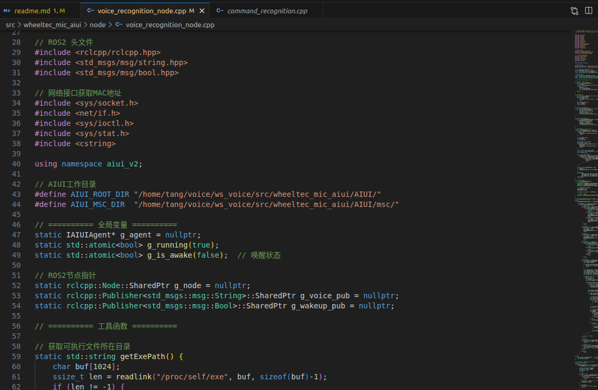
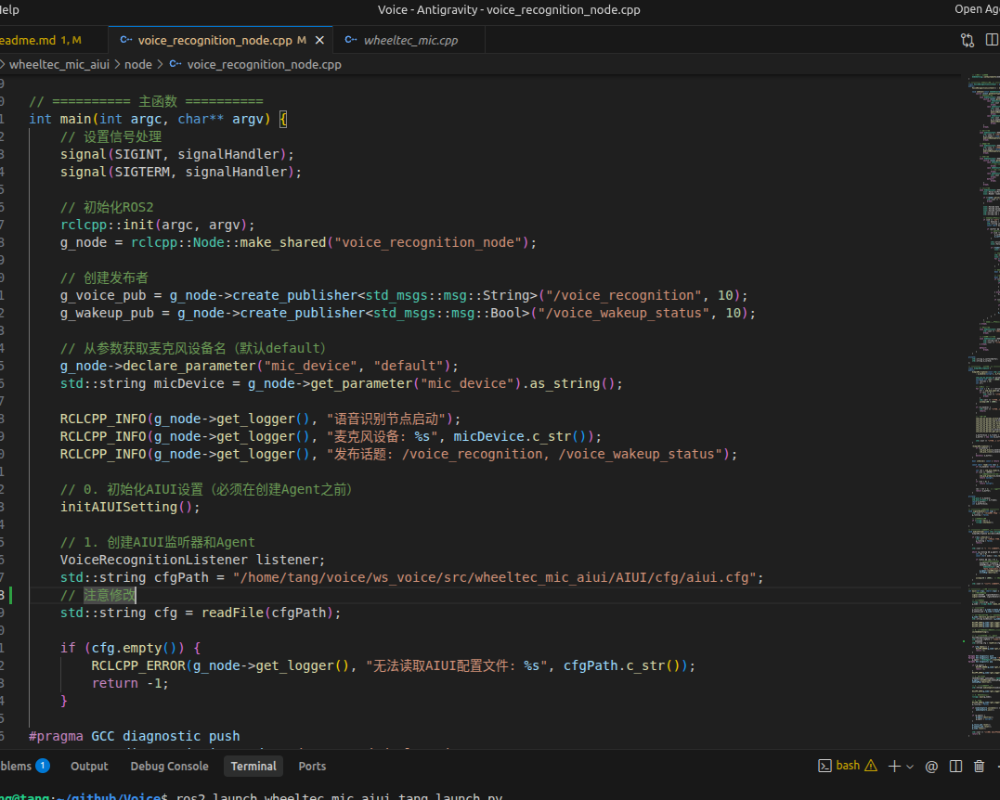
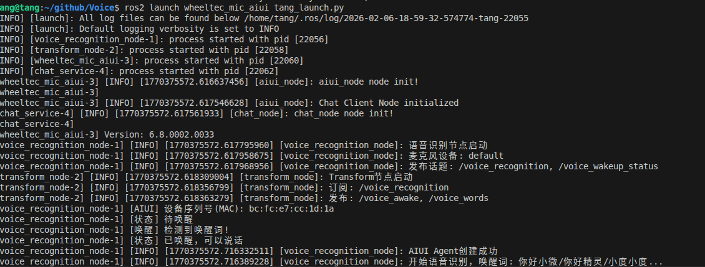
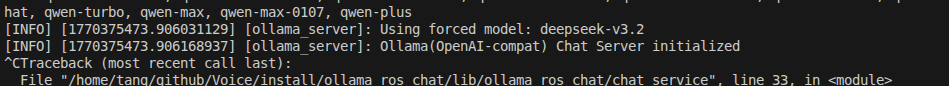

## 准备工作


这里路径需要修改
## 使用方法
1. 启动科大讯飞语音板
```
colcon build
source install/setup.bash
ros2 launch wheeltec_mic_aiui tang_launch.py
# 即可启动程序，这时候连接科大讯飞语音板即可
```

2. 启动大模型
```
colcon build
source install/setup.bash
ros2 run ollama_ros_chat chat_service
# 即可启动程序，这时候连接科大讯飞语音板即可
```

## 常见问题
- 1'/home/tang/github/Voice/install/wheeltec_mic_aiui/lib/wheeltec_mic_aiui/voice_recognition_node: error while loading shared libraries: libaiui.so: cannot open shared object file: No such file or directory
[wheeltec_mic_aiui-3] /home/tang/github/Voice/install/wheeltec_mic_aiui/lib/wheeltec_mic_aiui/wheeltec_mic_aiui: error while loading shared libraries: libaiui.so: cannot open shared object file: No such file or directory'

- 解决：
find /home/tang/github/Voice/ -name "libaiui.so"
export LD_LIBRARY_PATH=$LD_LIBRARY_PATH:/home/tang/github/Voice/src/wheeltec_mic_aiui/libs/x64
即可解决
## 特别鸣谢
吊毛沛民=-=
